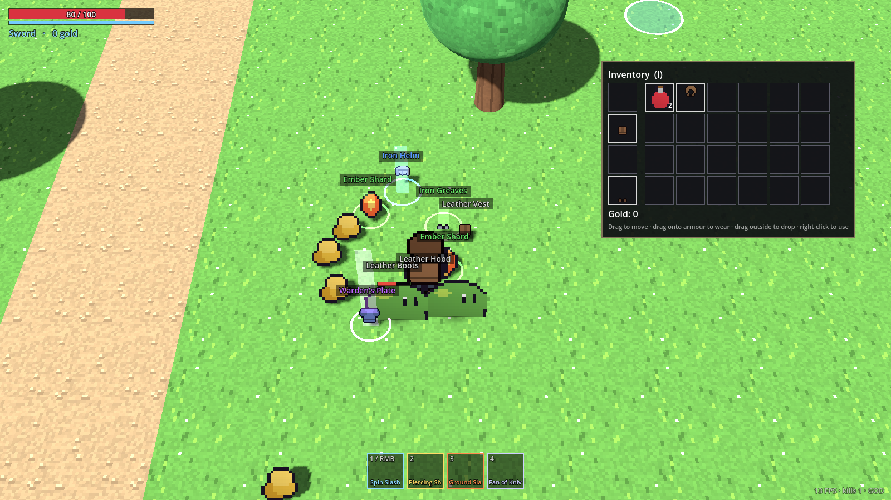
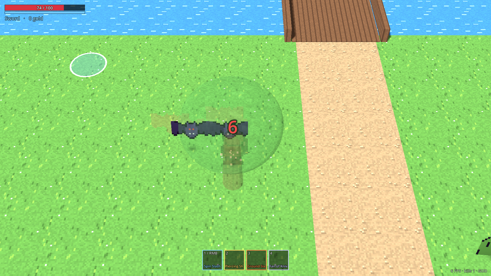
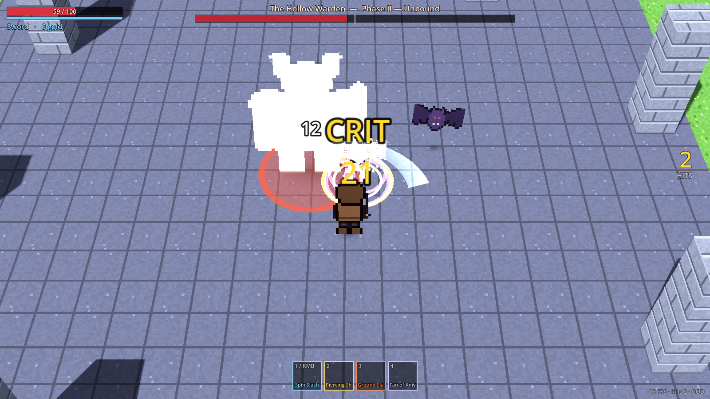

# Unity vs Godot สำหรับ Vela — ผลทดลอง + คำแนะนำการลงทุน

> เอกสารนี้มาจากการ port prototype เดียวกันไป Godot 4.3 (`godot/`) ครั้งเดียวเพื่อเทียบ
> ตัวเลข config, มอนสเตอร์, บอส, อาวุธ, สกิล, ของดรอป **เหมือน Unity ทุกค่า** — ต่างกันแค่ engine
> ข้อมูลราคา/ฟีเจอร์ของ engine เปลี่ยนเร็ว ควรเช็คหน้าเว็บทางการอีกครั้งก่อนตัดสินใจลงเงิน

## สรุปสั้น (TL;DR)

| คำถาม | คำตอบสั้น |
|---|---|
| Godot ไม่เหมาะกับ Online? | **ไม่ถึงขั้นไม่เหมาะ** — co-op 2–4 คน / ห้องเล็ก ทำได้ดี (มี multiplayer ในตัว + dedicated server เบา) แต่ **ไม่มีบริการสำเร็จรูประดับ Photon Fusion/Quantum** ต้องเขียน prediction / lag compensation เองหรือใช้ addon ชุมชน ถ้าเป้าหมายเป็น MMO / ต้องการ backend สำเร็จรูป Unity ได้เปรียบ |
| 2.5D ใน 3D world ยากกว่า? | **ไม่ยากกว่า — ง่ายกว่านิดหน่อย** Sprite บน quad, billboard, Label3D (ตัวเลขดาเมจ), nearest filter, shader dither ทำได้ในโค้ดน้อยกว่า ทั้ง port ใช้ ~4.7k บรรทัด vs Unity ~9k บรรทัด (runtime) |
| Render / physics ไม่สมจริงกว่า? | **Render:** Unity (URP/HDRP) เหนือกว่าเรื่องแสงสมจริง, VFX Graph, เครื่องมือ lighting — แต่เกมสไตล์ pixel 2.5D แบบ Alabaster Dawn **ไม่ได้ใช้ความสมจริงระดับนั้น** Godot Forward+ พอเหลือ. **Physics:** เกมนี้ไม่ได้ใช้ physics จำลองจริง (ใช้ character controller + overlap query) จึงแทบไม่ต่าง; Godot 4.4+ มี Jolt ในตัวแล้ว |
| ข้อได้เปรียบใหญ่ที่สุดของ Godot สำหรับเรา | **Claude รันเกมเองได้ใน cloud** — เทส 38 ข้อ + บอทเล่นเกม 18 ข้อ + ถ่ายภาพหน้าจอ ใช้เวลา ~5 วินาที ส่วน Unity ใน session นี้ทำได้แค่ compile-check |
| ข้อเสียใหญ่ที่สุดของ Godot | Console (Switch/PS/Xbox) ต้องผ่านบริษัท porting ภายนอก, asset store/คนที่จ้างได้น้อยกว่า, GDScript ช้ากว่า C# เมื่อศัตรูเยอะมาก |

**คำแนะนำ:** ถ้าเป้าหมายคือ **PC (Steam) + co-op online ขนาดเล็ก + ทีมเล็กที่ใช้ Claude agent เป็นแรงงานหลัก**
→ Godot คุ้มที่จะลงทุนต่อ ถ้าต้องการ **console ตั้งแต่วันแรก, online ขนาดใหญ่ด้วยบริการสำเร็จรูป, หรือจะจ้างทีม Unity**
→ อยู่ Unity ต่อ. ก่อนตัดสินใจ ให้ทำ "spike 2 สัปดาห์" ในหัวข้อสุดท้าย

---

## 1. สิ่งที่ทำในการทดลองนี้

| | Unity (ของเดิม) | Godot 4.3 (port) |
|---|---|---|
| โค้ดเกม | ~9,000 บรรทัด C# | ~4,700 บรรทัด GDScript |
| โค้ด tools + tests | ~2,800 บรรทัด | ~960 บรรทัด |
| ฟีเจอร์ | ครบ | ครบเท่ากัน: 3 อาวุธ + charge, 4 สกิล + mouse binding, lock-on, perfect dodge + counter, punish, hit weight/hit-stop/shake, 5 มอนสเตอร์ + dummy, บอส 2 เฟส 1 HP bar, loot/rarity/inventory drag-drop, paper doll 4 ทิศ, jump link ข้ามน้ำ, วัตถุโปร่งใสเมื่อบัง, เสียง placeholder |
| Config ให้ designer ปรับ | ScriptableObject `.asset` | Resource `.tres` (เปิดใน Inspector ได้เหมือนกัน) |
| Claude รันเกมใน cloud ได้? | ❌ (ต้องมี license + editor หลาย GB) — ทำได้แค่ compile check | ✅ headless: logic test 38 ข้อ + bot เล่นจริง 18 ข้อ ~5 วินาที, ถ่าย screenshot ผ่าน Xvfb |
| ขนาดตัว engine | หลาย GB + Hub + license | ไฟล์เดียว ~110 MB |

ภาพจาก Godot build (render ด้วย software OpenGL ใน cloud จึง FPS ต่ำ — เครื่องจริงจะลื่น):

| | |
|---|---|
|  |  |
|  |  |

**บั๊กที่เจอเพราะรันได้จริง** (ตัวอย่างว่าการที่ agent รันเกมเองได้มีค่าแค่ไหน):
- squash/stretch spring ระเบิดเมื่อ FPS ต่ำ (sprite ขยายเต็มจอ) → แก้ด้วย sub-step
- วัตถุ fade แล้วยังบังตัวละคร → เปลี่ยนเป็น alpha blend ระหว่าง fade
- ตัวเลขดาเมจใหญ่เกิน, ของจากมอนสเตอร์กับของในกระเป๋าเป็นคนละ resource (potion ไม่ stack) → แก้ + มีเทสกันไว้

บั๊กประเภทนี้ใน Unity จะเจอก็ต่อเมื่อคุณกด Play เอง

---

## 2. Online — Godot ไม่เหมาะจริงไหม

**สิ่งที่ Godot มีในตัว:** `MultiplayerAPI` (RPC, `MultiplayerSpawner`, `MultiplayerSynchronizer`), ENet (UDP),
WebSocket, WebRTC, export แบบ dedicated server (ตัด graphic ออก, รันบน Linux เบามาก)

**สิ่งที่ Godot ไม่มี (ต้องทำเอง/ใช้ addon):**
- client-side prediction, reconciliation, lag compensation, rollback → มี addon ชุมชน (เช่น *netfox*) แต่ไม่ใช่ของบริษัทที่มี SLA
- บริการ backend ครบวงจร (matchmaking, relay, lobby, hosting) แบบ Unity Gaming Services / Photon → ใช้ของกลางได้ เช่น Nakama (มี client Godot), Steam networking, หรือเขียนเอง

**Unity ได้เปรียบตรงไหน:** Photon Fusion / Quantum (deterministic, เหมาะ action), Netcode for GameObjects, Mirror/FishNet,
ตัวอย่าง + คนที่เคยทำ online ใน Unity หาได้ง่ายกว่ามาก

**สำหรับ ARPG แบบ Alabaster Dawn co-op:** งานยากจริงคือ *การออกแบบ* (server-authoritative, input เป็นคำสั่ง,
hit-stop แบบ local, i-frame มี latency allowance) — ซึ่งเราวางไว้แล้วทั้งสอง engine (`PlayerCommands`, `HitStopMode.LOCAL_VISUAL`,
`perfect_latency_allowance`, `VelaRandom`/`Game.roll`). ส่วน transport ทั้งสอง engine มีให้

| ขนาด online ที่ตั้งใจ | แนะนำ |
|---|---|
| co-op 2–4 คน, host-client / dedicated เล็ก | Godot ได้สบาย |
| ห้อง 8–32 คน, PvP แข่งขัน | ทำได้ทั้งคู่ แต่ Unity + Photon ลดความเสี่ยง/เวลา |
| MMO / persistent world | Unity (หรือ engine + backend เฉพาะทาง) — Godot ต้องสร้างเองเกือบทั้งหมด |

---

## 3. 2.5D ใน 3D world — ยากกว่าไหม

ไม่ยากกว่า. สิ่งที่ Alabaster Dawn style ต้องการ และความยากในแต่ละ engine จากการ port จริง:

| สิ่งที่ต้องทำ | Unity | Godot |
|---|---|---|
| sprite pixel บน quad หันหากล้อง | SpriteRenderer/Quad + script billboard | MeshInstance3D + shader / `Sprite3D` ในตัว |
| ตัวเลขดาเมจในโลก 3D | ต้อง world-space canvas หรือ TextMesh | `Label3D` ในตัว (fixed size, billboard, outline) |
| paper doll หลายชั้น + ลำดับตามทิศ | เท่ากัน | เท่ากัน |
| วัตถุโปร่งใสเมื่อบัง | raycast + เปลี่ยน material | เหมือนกัน (ใช้ Area3D ชั้นแยก ไม่กวน physics) |
| pixel ไม่เบลอ | ตั้ง import ทีละ texture | `filter_nearest` ใน shader/material |
| UI inventory drag & drop | uGUI/UI Toolkit (ต้องเขียน drag handler) | Control มี `_get_drag_data/_drop_data` ในตัว |

ข้อควรระวังเหมือนกันทั้งคู่: sprite บน quad ไม่รับเงา/แสงอัตโนมัติ (เราใช้ unshaded + blob shadow),
ต้องคุม draw order ของชั้น paper doll เอง

---

## 4. Render / Physics — ไม่สมจริงกว่าไหม

**Render**
- Godot มี 3 renderer: *Forward+* (Vulkan/D3D12, มี SDFGI/VoxelGI, volumetric fog, SSR, SSAO, glow),
  *Mobile*, *Compatibility* (OpenGL/WebGL — ที่ port นี้ใช้ เพื่อรันได้ทุกเครื่องและใน cloud)
- Unity URP/HDRP ยัง **นำ** เรื่องแสงสมจริง, lightmapper, Shader Graph, **VFX Graph** (particle ปริมาณมหาศาล),
  post-processing และ asset/เอฟเฟกต์สำเร็จรูป
- สำหรับเกม pixel 2.5D: ความสวยมาจาก **art direction + palette + lighting แบบ stylized + effect มือ** มากกว่าความสมจริงของ engine
  ทั้งสอง engine ทำ look แบบ Alabaster Dawn ได้ Unity จะเร็วกว่าถ้าจะซื้อ VFX/shader สำเร็จรูปมาใช้

**Physics**
- เกมนี้ **ไม่ได้ใช้ rigidbody จำลองจริง**: ตัวละครเป็น kinematic (`CharacterBody3D` / `CharacterController`),
  การโจมตีเป็น overlap query → ผลเหมือนกันทั้งสอง engine และแบบนี้ดีกว่าสำหรับ online (คาดเดาได้)
- Godot Physics เดิมอ่อนกว่า PhysX; ตั้งแต่ Godot 4.4 มี **Jolt** ในตัวให้เลือก (ใช้ใน AAA หลายเกม)
- ถ้าอนาคตต้องมี ragdoll, ของพังเป็นชิ้น, ฟิสิกส์ซับซ้อน → Unity ยังสบายกว่า

**Performance**
- GDScript ช้ากว่า C# หลายเท่าในลูปหนัก ๆ; ศัตรู 10–50 ตัวไม่มีปัญหา ถ้าจะมีเป็นร้อย ๆ ตัว → ใช้ C# ใน Godot (.NET build; ข้อจำกัด: export web ยังไม่ได้)
  หรือ GDExtension (C++/Rust) เฉพาะส่วนหนัก. Unity มี Burst/Jobs/ECS ถ้าต้องการจำนวนมหาศาล

---

## 5. ตารางเทียบรวม (สำหรับเกมนี้โดยเฉพาะ)

| หัวข้อ | Unity 6 | Godot 4 | ผู้ชนะสำหรับ Vela |
|---|---|---|---|
| ค่าใช้จ่าย/license | ฟรีถึงเพดานรายได้ แล้วเสียต่อที่นั่ง (ตรวจราคาล่าสุด) | MIT ฟรีตลอด ไม่มี royalty | Godot |
| Console | official | ผ่านบริษัท porting (เช่น W4 Games) | Unity |
| Online สำเร็จรูป | Photon, NGO, UGS | built-in พื้นฐาน + addon ชุมชน | Unity |
| 2.5D pixel ในโลก 3D | ดี | ดี (โค้ดน้อยกว่า) | เสมอ / Godot นิด ๆ |
| Rendering สมจริง / VFX | เหนือกว่า | พอสำหรับ stylized | Unity (แต่ไม่ critical) |
| Physics | PhysX | Godot Physics / Jolt | เสมอสำหรับเกมนี้ |
| Asset store / คนที่จ้างได้ | ใหญ่มาก | กำลังโต | Unity |
| ขนาด/ความเร็ว iteration | editor หนัก, compile รอ | เปิดไว, ไม่มี compile รอ | Godot |
| ไฟล์ scene/config diff/merge | YAML อ่านยาก merge ยาก | `.tscn/.tres` text อ่านง่าย | Godot |
| **ให้ Claude agent เทส/เล่นเกมเองใน CI/cloud** | ต้อง license activation + runner หนัก (GameCI) | ไฟล์เดียว headless ได้ทันที | **Godot (ชัดเจน)** |

---

## 6. ถ้าจะใช้ Claude agent เป็นแรงงานหลัก — ทำไมเรื่องนี้สำคัญ

แผน 10 agent (`.claude/agents/`) ทำงานได้ดีที่สุดเมื่อ agent **พิสูจน์งานตัวเองได้** ก่อนส่ง PR
- Godot: agent เขียน feature → รัน `tests/run.sh` (logic + bot เล่นจริง) → ถ่าย screenshot แนบ PR → คุณเล่นเฉพาะเรื่อง *feel*
- Unity: agent เขียน → compile check → **คุณต้องเป็นคนกด Play ทุกครั้ง** เพื่อจับบั๊กพื้นฐาน (เหมือนที่เคยเจอ MissingReference ตอนแรก)

Unity ทำให้ใกล้เคียงได้ด้วย GameCI + Unity license บน GitHub Actions (runner ใหญ่, ช้ากว่า, ตั้งค่ายุ่งกว่า) — เป็นค่าใช้จ่ายที่ต้องนับ

---

## 7. คำแนะนำการลงทุน

### ลงทุนได้เลย ไม่ว่าจะเลือก engine ไหน (ย้ายได้ทั้งหมด)
1. **Game design data** — ตัวเลขทุกตัวอยู่ใน config (ทำแล้วทั้งสองฝั่ง) → ย้าย engine = เขียน loader ใหม่
2. **Art pipeline** — sprite 16×24 / 3 ทิศ / bottom-center pivot / palette (`docs/art-pipeline.md`) ใช้ได้ทั้งสอง engine โดยไม่แก้ไฟล์ภาพ
3. **Spec + edge-case tests** (`docs/specs/`) — logic เดียวกัน เทสแปลงภาษาได้ตรง ๆ
4. **สถาปัตยกรรม online-ready** — input เป็นคำสั่ง, RNG กลาง, hit-stop แบบ local, latency allowance
5. **เสียง + animation จริง** — ส่วนที่ทำให้ "ฟันแล้วรู้สึกจริง" มากที่สุด และไม่ผูกกับ engine

### Spike 2 สัปดาห์ ก่อนเลือก engine (แนะนำ)
| วัน | ทำอะไร | วัดอะไร |
|---|---|---|
| 1–2 | คุณเล่น Unity กับ Godot build สลับกัน (ตัวเลขเดียวกัน) | feel ต่างกันไหม, iteration แก้ค่าแล้วเห็นผลเร็วแค่ไหน |
| 3–6 | ทำ **co-op 2 คน** ใน Godot (ENet + host, ส่ง `PlayerCommands`, ศัตรูคิดที่ host) | ความยาก, ความลื่นที่ ping 100 ms |
| 7–8 | ใส่ sprite จริง 1 ตัวละคร + 1 มอนสเตอร์ + เสียงจริงชุดเล็ก ทั้งสอง engine | pipeline art ติดขัดไหม |
| 9–10 | ทดสอบ 100 ศัตรูบนจอ + เครื่องสเปกต่ำ | FPS, ต้องใช้ C#/GDExtension ไหม |

### เกณฑ์ตัดสินใจ
- ต้องลง **console** ภายใน 1–2 ปีแรก → **Unity**
- online **เกิน co-op เล็ก** หรืออยากได้ backend สำเร็จรูป → **Unity**
- จะ **จ้างคน** มาช่วยและหาคน Godot ไม่ได้ → **Unity**
- PC/Steam ก่อน, co-op เล็ก, ทีมเล็ก + Claude agent ทำงานส่วนใหญ่, อยากคุมต้นทุนระยะยาว → **Godot**

---

## 8. ลองเทียบเองแบบ side-by-side

1. เปิด Unity build (`Assets/Scenes/CombatPrototype.unity`) และ Godot build (`godot/project.godot` → F5)
2. เล่นเหมือนกัน: คอมโบดาบกับสไลม์ → charge greatsword ใส่ brute จน BREAK → perfect dodge การพุ่งของ brute แล้ว counter
   → กระโดดข้ามแม่น้ำ → เก็บของ/ใส่เกราะ → บอสเฟส 2
3. จดสิ่งที่ "รู้สึกต่าง" — ถ้าต่าง ส่วนใหญ่เป็นเรื่อง timing ของ hit-stop/shake/animation ปรับที่ `data/feel.tres` หรือ `Assets/Config/CombatFeel`
4. ลองแก้ค่าใน config ทั้งสองฝั่ง (เช่น `dash_time`, `hit_stop`) แล้วดูว่าฝั่งไหนเห็นผลเร็วกว่า
