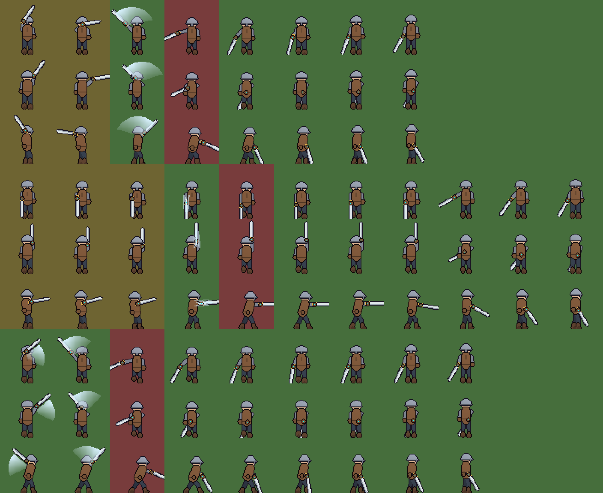

# Spec: one-handed sword animation + swappable gear (placeholder phase)

**Goal:** find out, with placeholder art, which animation setup makes the one-handed sword look
weighty. One set of animations is shared by every hat, shirt, glove, boot and sword skin, and
changing gear shows up on the next frame, even mid-swing.

**Owners:** `character-visual` (lead), `combat-designer` (attack phases ↔ hits),
`tools-build` (Aseprite importer), `qa-tester` (tests below).

## Decisions (director, this phase)

| Topic | Decision |
|---|---|
| Canvas | **64 × 64 px** per frame, bottom-center pivot (feet). Replaces 16×24. |
| Character height | ~40–44 px inside the canvas. The rest is swing room for the sword and smears. *(To confirm with the first A/B test.)* |
| First weapon class | One-handed sword |
| Art | Placeholder mannequin generated in code. Real art comes after the A/B test. |
| Tool | Aseprite. Animators animate there; Unity only plays the result (see pipeline). |

## How each layer follows the body

| Layer | Method | Art needed per item |
|---|---|---|
| Body (+ hair) | Full frame-by-frame animation | every frame (drawn once, shared by all gear) |
| Head gear | **Anchor**: every body frame stores a head point (+ optional tilt); the hat is placed on it | 3 facings |
| Weapon | **Anchor + angle**: every body frame stores a hand point, a blade angle and in-front/behind | 1 sprite (or 8–16 pre-rotated for crisp pixels) |
| Chest / hands / feet | Spike: **(A)** a layer drawn on every frame, or **(B)** lookup texture (the body frame is painted with code colors, the garment is a small texture a shader maps onto it) | (A) every frame / (B) one texture |
| Colors / materials | Tint / palette swap (already works) | 0 |
| Smear / slash light | Separate FX sprite per attack. Not part of the weapon, so every skin gets it. | per attack, once |

## Attack phases drive the animation

Each attack animation is tagged in Aseprite: `windup`, `smear`, `impact`, `follow`, `recovery`.
Unity stretches or squeezes each part to the timings in the weapon config. Designers retune
speed without redrawing, and the impact frame always lands on the frame that deals damage.

| Config phase | Animation parts played in it |
|---|---|
| windup | windup (last pose held via frame weight) → smear |
| active | impact (held by hit-stop). Damage lands on its first frame. |
| recovery | follow → recovery |

Within a phase, each frame gets time in proportion to its **weight** (weight 3 = held three
times as long). When windup is 0 (the charged Dash Strike), the smear frames play at the start
of active instead.

Sword numbers today, in frames at 60 fps (from `Assets/Config/Weapons/Sword.asset`):

| Attack | windup | active | recovery | Drawn frames (target) |
|---|---|---|---|---|
| Slash | 3 | 5 | 12 | windup 2 · smear 1 · impact 1 · follow 2 · recovery 2 |
| Backslash | 3 | 5 | 12 | same shape, mirrored arc |
| Thrust Finisher | 6 | 6 | 21 | windup 3 (hold) · smear 1 · impact 1 · follow 3 · recovery 3 |
| Dash Strike (charged) | 0 | 11 | 21 | smear 2 · impact 1 · follow 3 · recovery 3 |

## Pipeline: animate in Aseprite, not in Unity

Pixel-art frames are drawn, not tweened. Moving separate parts in Unity (cut-out animation) looks
like a puppet, so all posing happens in Aseprite and Unity only reads the result.

One `.aseprite` file per body animation set (e.g. `hero_sword.aseprite`):
- **Layers:**
  - `body`, `hair`, and during spike (A) `chest` / `hands` / `feet`.
  - Marker layers: `@head` (1 px at the head point), `@hand` (1 px at the grip, plus 1 px
    at the blade tip for the angle), and `@hand_front` (a pixel on frames where the weapon
    is drawn in front).
- **Tags:** `idle_down`, `idle_up`, `idle_side`, `walk_*`, `attack1_*`, …. Inside attacks,
  sub-tags `windup` / `smear` / `impact` / `follow` / `recovery`.
- **Gear files:** hats and weapons are separate small files, one frame per facing (or per
  angle). Nothing to animate.
- **Export:** the Aseprite CLI (script in `Tools/`) writes one sheet per layer plus a JSON file.
  The Unity importer turns the sheets and JSON into:
  - frame arrays per state and facing,
  - anchor data per frame (from the marker pixels),
  - phase ranges per attack.

  Marker layers are never rendered.

## Placeholders to build (code-generated, replaceable)

1. **Mannequin 64×64:** grey body with a colored head, torso, arms and legs. States idle,
   walk, dash, hurt and the four sword attacks, each drawn in 3 facings.
2. **Anchor data** for every frame (head, hand, blade angle, weapon in front/behind), stored
   in an asset so it can be tuned.
3. **Test gear:**
   - hats: 3 clearly different shapes (small cap, tall helm, wide hat), to show anchors
     are right;
   - swords: 3 (short, long, broad);
   - shirts: 2 and boots: 2, made for both spike (A) and spike (B).
4. **Smear FX** per attack.
5. **Debug overlay** (toggle key):
   - anchor points;
   - a phase color bar (yellow windup / red active / blue recovery);
   - the frame number;
   - the hitbox arc.

## A/B test scene

The same sword combo in three looks, switched with a key:
1. Today's single frame plus code squash / lean.
2. Three-frame attacks (windup / impact / recovery).
3. The full five parts with smear and a held impact.

The director rates the "weight" of each. That rating decides how many frames the real art gets.

## Edge cases (tests)

- Every layer of a state has the same frame count as the body (the importer rejects mismatches).
- Every attack has an Impact frame, and its parts never go backwards (Windup → Smear → Impact → Follow → Recovery).
  Windup and Smear may be missing (Dash Strike has no windup).
- Stretched timing: the impact part starts exactly at the config's active start (±1 frame at 60 fps).
- Swapping a hat, weapon or shirt mid-attack keeps the same frame index and doesn't restart the animation.
- An empty slot (no hat) renders nothing and doesn't shift other layers.
- A facing with no gear art (e.g. crown seen from the back) falls back to Down or hides, never errors.
- Marker layers never appear in game.
- Weapon draw order follows the per-frame front/behind flag, not only the facing.

## Status: week 1 built (placeholder)

| Piece | Where |
|---|---|
| Data: clips, per-frame anchors + part + weight, layer sheets | `Scripts/Visual/Animation/DollAnimationTypes.cs`, `DollAnimationSet.cs` |
| Phase stretching (pure, tested) | `Scripts/Visual/Animation/PhaseTimeline.cs` |
| Art contract check | `Scripts/Visual/Animation/DollAnimationValidator.cs` |
| Playback, anchors, per-frame weapon front/behind | `Scripts/Visual/PaperDoll.cs` (animated path; the old single-frame path is unchanged) |
| Attack → clip | `AttackStep.animation` (sword: slash / backslash / thrust / dash_strike); PlayerCombat calls `PaperDoll.PlayAttack` |
| Mannequin + garment sheets + anchored hats/swords | `Editor/PlaceholderArt.Mannequin.cs`, `Editor/ConfigDefaults.Animation.cs` → `Assets/Config/Characters/MannequinAnimation.asset`, atlases in `Assets/Art/Placeholder/Doll64/` |
| A/B + sword looks | F6 / F7 (`Gameplay/AnimationTestbench.cs`) |
| Debug overlay | F3 (`UI/DollDebugOverlay.cs`) |
| Tests | `Tests/EditMode/DollAnimationTests.cs` |

Preview of the generated frames, with a helm, vest, boots, gloves and the long sword.
Rows are down / up / side for Slash, Thrust and Dash Strike. Yellow = windup, red = impact.

Not yet built:
- the Aseprite importer (week 2);
- spike (B), the lookup texture;
- hurt / dash clips per weapon.

## Tuning (director, not tests)

| Asset | Field | What it changes |
|---|---|---|
| Sword.asset | windup / active / recovery per step | Attack speed. The animation stretches to fit. |
| MannequinAnimation.asset | `clips → frames → weight` (e.g. the held windup frame) | How heavy the anticipation feels |
| MannequinAnimation.asset | `clips → frames → hand / tip / head` | Blade arc shape, hat position |
| MannequinAnimation.asset | `characterHeightPixels` (44) | Character size inside the 64×64 canvas |
| PlayerRig.asset | `detail` (Full / KeyPoses / Procedural), `smearColor` | Default A/B mode, smear look |
| *Equipment*Visual.asset | `anchorOffset` | Where a hat sits on the head |
| CombatFeel.asset | hit-stop per weight | How long the impact frame freezes |

## Out of scope (this phase)

Real art, other weapon classes, and the URP migration (separate task).
