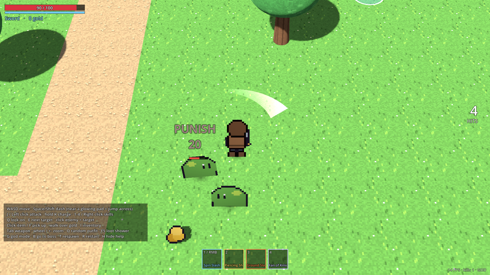

# Vela: Godot comparison port (Godot 4.3)

A one-off port of the Unity combat prototype, built so the two engines can be compared on the
same game. It uses the same numbers, monsters, boss, weapons, skills, loot and controls.
The Unity project is still the main one. Why this port exists, and what we learned from it:
[`docs/engine-comparison.md`](../docs/engine-comparison.md).



## Open and play

1. Download **Godot 4.3** (standard build, not .NET) from godotengine.org. It's one ~120 MB
   executable with no installer.
2. In the Project Manager choose **Import**, then pick `godot/project.godot`.
3. Press **F5** (Play).

The scene is built in code by `scripts/main.gd`, the same way Unity's `PrototypeSceneBuilder`
does it. There is no editor step to run first.

## Controls

| Key / mouse | Action |
|---|---|
| WASD | Move |
| Space / Shift | Dash. Next to a glowing pad, dash toward the other pad to **jump across the river**. |
| J / left click | Attack (combo) |
| hold K | Charged attack. Release when the ring flashes. |
| 1–4 / right click | Skills. Mouse buttons are set in `data/player.tres` → Mouse. |
| Q / E / click enemy | Lock on / next target / target that enemy |
| click item / F | Pick up. Only gold is collected by walking over it. |
| I | Inventory: drag to move, drag onto armour to wear, drag outside to drop, right-click to use |
| Tab | Cycle weapon (sword → bow → greatsword) |
| wheel / + − | Zoom |
| O · F5 · G · B · T · R · H | Outfit · loot shower · god mode · go to boss · respawn · restart · help |

## Tuning (same knobs as the Unity config assets)

All tuning lives in `data/*.tres`. Double-click a file to open it in the Inspector:

| File | What it tunes |
|---|---|
| `data/player.tres` | Movement, dash, perfect dodge window + latency allowance, counter, jump links, lock-on, aim assist, mouse bindings, weapons (combo steps, charged attack, crit), skills |
| `data/feel.tres` | Hit-stop mode (global / local), hit weight profiles (Light → Finisher), crit, punish, shake, zoom punch, damage numbers |
| `data/monsters/*.tres` | Each monster: HP, poise, movement style, attack list (kind, range, windup, damage, telegraph colour), loot table. `boss.tres` has two phases. |
| `data/items/*.tres` | Items: rarity, stack size, heal amount, equipment layer + tint |
| `data/loot_config.tres` | Drop scatter, pop height, rarity beams, pickup range, gold magnet, bag size |

If a file is deleted, the game falls back to the built-in defaults in
`scripts/config/defaults.gd`. `tools/make_data.gd` writes any missing files back and never
overwrites existing ones:

```bash
godot --headless --path godot -s res://tools/make_data.gd
```

To replace art, drop a new PNG over the one in `art/`. Same size, bottom-centre pivot, 3 facings
for the paper doll, as in `docs/art-pipeline.md`. To replace a sound, put
`audio/<event>.wav` or `.ogg` in the project (for example `audio/hit_heavy.wav`). It's picked
up in place of the synthesized placeholder.

## Tests (headless, ~5 seconds)

```bash
cd godot
GODOT=/path/to/godot tests/run.sh
```

- `tests/run_tests.gd`: 38 logic checks covering inventory stacking and full bag, loot rates
  and guaranteed drops, hit-weight thresholds, i-frames → evaded, no friendly fire, immortal
  dummy, jump-link rules, and default content.
- `tests/smoke_test.gd`: loads the real game and a bot plays it through `PlayerCommands`.
  It checks:
  - Perfect dodge and counter.
  - A jump across the river, and that water blocks walking.
  - The sword kills the meadow monsters.
  - Loot drops and gets picked up.
  - A full bag refuses items.
  - The bow fires.
  - Boss phase II at 50% with summons, then boss death and loot.

Screenshots for the docs (needs a display, or Xvfb on Linux):

```bash
xvfb-run -s "-screen 0 1600x900x24" godot --path . --rendering-driver opengl3 res://tools/screenshot.tscn
```

## Layout

```
scripts/core/      Game (autoload: clock, hit-stop, shake, RNG, messages, input map), Health, DamageInfo
scripts/config/    Resource classes (= Unity ScriptableObjects) + defaults.gd
scripts/player/    PlayerCommands (input as data), PlayerInput (keyboard/mouse → commands), Player
scripts/enemies/   Enemy (data-driven brain + boss phases)
scripts/combat/    Combat (hit tests), Projectile, Feedback (hit feel)
scripts/items/     Inventory, LootTable roll → Loot scatter, WorldItem
scripts/visual/    SpriteRig (billboard paper doll, 4-way facing, squash, flash, blink)
scripts/fx/        Fx autoload (particles, slashes, rings, afterimages, damage numbers), Telegraph
scripts/world/     Level (greybox builder), JumpLink, OcclusionFader
scripts/camera/    CameraRig (locked 3/4, zoom, follow, shake)
scripts/ui/        Hud (drawn), InventoryUI + InvSlot (drag & drop Controls)
scripts/audio/     Sfx autoload (synthesized placeholders, replaceable)
```

## Known differences from the Unity build

- The HUD is drawn in code. The inventory uses real Godot Controls, which is closer to what a
  shipped UI would use than Unity's IMGUI placeholder.
- The occlusion fade switches the object to alpha blending while it fades, because it's
  opaque the rest of the time.
- The hit-stop `GLOBAL_TIME_SCALE` mode uses `Engine.time_scale`, like Unity's
  `Time.timeScale`.
- Nobody has play-tested it by hand yet. It was checked by the bot and by screenshots only.
  The feel numbers are the same, but compare the two side by side before trusting it.
